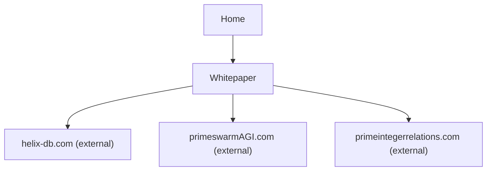

## 1. Product Overview
Add a dedicated Whitepaper page to the Only Institute website.
Expose it via a prominent link from the Home page “Memory” card and include curated external references.

## 2. Core Features

### 2.1 User Roles
Not required (public, read-only content).

### 2.2 Feature Module
1. **Home**: Memory pillar card CTA link to the Whitepaper page.
2. **Whitepaper**: Readable manifesto/whitepaper content + external reference links.

### 2.3 Page Details
| Page Name | Module Name | Feature description |
|-----------|-------------|------------------|
| Home | Memory card CTA | Navigate to **Whitepaper** page from the “Memory” pillar card (e.g., via the existing “Technical Spec” CTA area). |
| Whitepaper | Whitepaper content | Present the whitepaper in structured sections (headline, abstract/summary, key pillars, and conclusion). |
| Whitepaper | External references | Link out to: helix-db.com, primeswarmAGI.com, primeintegerrelations.com (open in new tab, clearly labeled as external). |

## 3. Core Process
User Flow (Public):
1. You land on Home.
2. You click the CTA on the “Memory” card.
3. You read the Whitepaper.
4. You optionally follow external reference links for deeper technical context.

