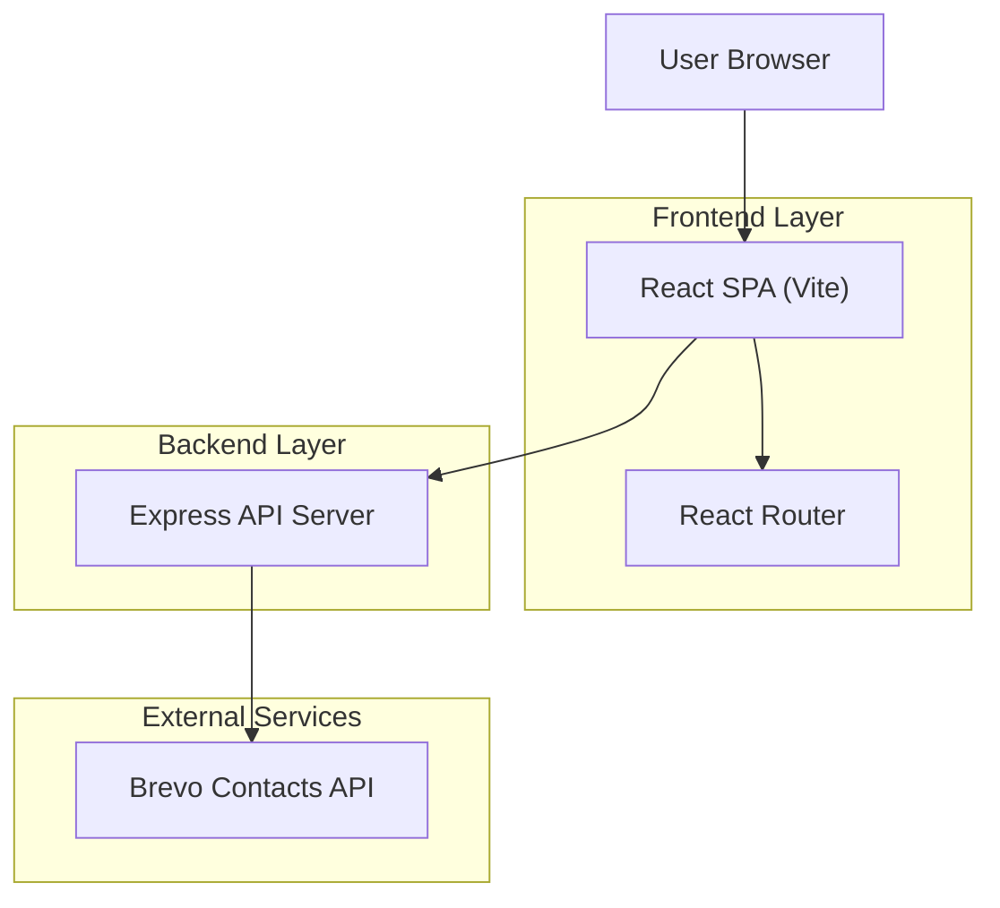

## 1.Architecture design


## 2.Technology Description
- Frontend: React@19 + react-router-dom@7 + tailwindcss@4 + vite@6 + motion + lucide-react
- Backend: Express@4 (existing; serves SPA + handles newsletter subscribe)

## 3.Route definitions
| Route | Purpose |
|-------|---------|
| / | Home page; includes “Memory” card CTA linking to Whitepaper |
| /whitepaper | New Whitepaper page (read-only content + external links) |
| /resources | Resources list (existing) |
| /blog | Blog list (existing) |
| /blog/:id | Blog article detail (existing) |

## 4.API definitions (If it includes backend services)
### 4.1 Core API
Newsletter subscription (existing)
```
POST /api/subscribe
```
Request:
| Param Name| Param Type | isRequired | Description |
|----------|------------|------------|-------------|
| email | string | true | Email address |

Response:
| Param Name| Param Type | Description |
|----------|------------|-------------|
| success | boolean | Indicates success |
| error | string | Error code/message when failed |

## 6.Data model(if applicable)
None (no database required for Whitepaper page).
